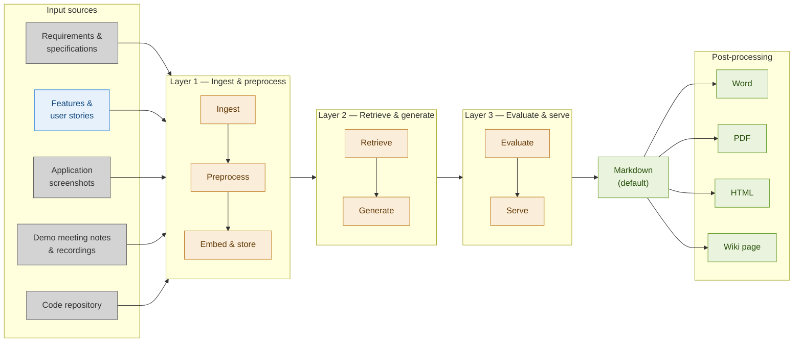

# Functional Guide Generator — Architecture

```mermaid
flowchart LR
  subgraph SRC["Input sources"]
    I1["Requirements &<br/>specifications"]:::darkgrey
    I2["Features &<br/>user stories"]:::blue
    I3["Application<br/>screenshots"]:::darkgrey
    I4["Demo meeting notes<br/>& recordings"]:::darkgrey
    I5["Code repository"]:::darkgrey
  end

  subgraph L1["Layer 1 — Ingest & preprocess"]
    direction TB
    A1[Ingest]:::amber --> A2[Preprocess]:::amber --> A3[Embed & store]:::amber
  end

  subgraph L2["Layer 2 — Retrieve & generate"]
    direction TB
    B1[Retrieve]:::amber --> B2[Generate]:::amber
  end

  subgraph L3["Layer 3 — Evaluate & serve"]
    direction TB
    C1[Evaluate]:::amber --> C2[Serve]:::amber
  end

  MD["Markdown<br/>(default)"]:::green

  subgraph POST["Post-processing"]
    P1[Word]:::green
    P2[PDF]:::green
    P3[HTML]:::green
    P4[Wiki page]:::green
  end

  I1 & I2 & I3 & I4 & I5 --> L1
  L1 --> L2
  L2 --> L3
  L3 --> MD
  MD --> P1 & P2 & P3 & P4

  classDef blue  fill:#E6F1FB,stroke:#378ADD,color:#0C447C
  classDef darkgrey fill:#D3D3D3,stroke:#666666,color:#333333
  classDef amber fill:#FAEEDA,stroke:#BA7517,color:#633806
  classDef green fill:#EAF3DE,stroke:#639922,color:#27500A
```
