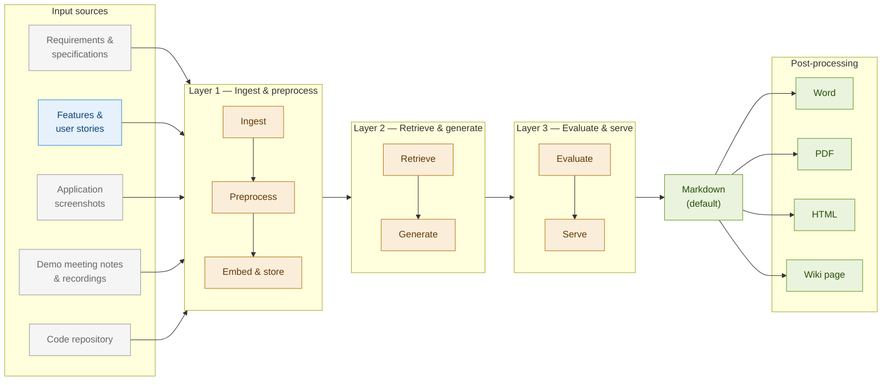

For this architecture overview, check also the System design under chapter 3. 

# Functional Guide Generator — Architecture Diagram

## System Architecture

## Architecture Overview

### Input Sources

**Primary input source (active):**
- **Features & user stories** — Agile board items (Jira, Azure DevOps)

**Future input sources (greyed out):**
- Requirements & specifications (wiki, documents, product backlog)
- Application screenshots
- Demo meeting notes & recordings
- Code repository (GitHub, etc.)

### Processing Layers

1. **Layer 1 — Ingest & Preprocess**
   - Ingest: fetch raw artifacts from source systems
   - Preprocess: clean, validate, and chunk text
   - Embed & store: convert chunks to vectors and store with metadata

2. **Layer 2 — Retrieve & Generate**
   - Retrieve: semantic search to fetch relevant chunks
   - Generate: LLM synthesis into functional documentation

3. **Layer 3 — Evaluate & Serve**
   - Evaluate: quality scoring via LLM-as-judge and manual review
   - Serve: deliver final documentation

### Output Formats

**Default:** Markdown

**Post-processing options:**
- Word
- PDF
- HTML
- Wiki page
