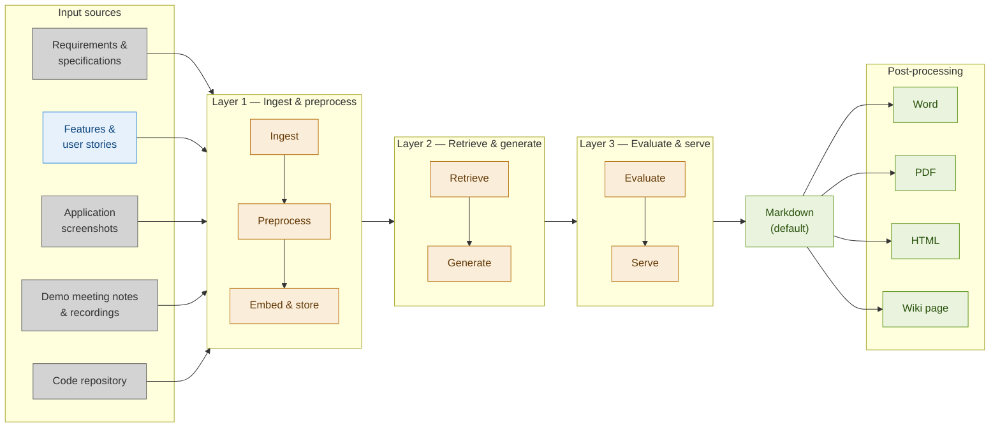

# Functional Guide Generator

**System Design Document** · *v12*

---

## Table of Contents

1. [Motivation](#motivation)
   - [Problem statement](#problem-statement)
   - [Solution](#solution)
   - [Restrictions](#restrictions)
   - [Prerequisite for implementation](#prerequisite-for-implementation)

2. [System Components](#system-components)
   - [Layers](#layers)
   - [Component details](#component-details)

3. [Data Flow](#data-flow)
   - [Ingestion & Preprocessing](#ingestion--preprocessing-offline--on-demand)
   - [Retrieval, Generation & Evaluation](#retrieval-generation--evaluation-online--per-request)

4. [Model and Tool Choices](#model-and-tool-choices)

5. [Evaluation Strategy](#evaluation-strategy)
   - [Evaluation metrics](#evaluation-metrics)
   - [Evaluation Pipeline](#evaluation-pipeline)
   - [Key Evaluation Questions](#key-evaluation-questions)

6. [Trade-offs and Limitations](#trade-offs-and-limitations)

7. [Ideas to Improve Overall Quality](#ideas-to-improve-overall-quality)

8. [Biggest Challenges](#biggest-challenges)

9. [ANNEX – Next Steps / Iterations](#annex--next-steps--iterations)
   - [First Implementation Steps](#91-first-implementation-steps)
   - [Incremental Improvements](#92-incremental-improvements--possible-next-iterations)

---

## 1. Motivation

### 1.1 Problem statement

Writing functional documentation after the implementation of a software feature is rarely done in practice. Developers start working on next tickets, product owners focus on acceptance or the next backlog item — the acquired knowledge embedded in tickets, code, wikis, and demos never makes it into a more functional-oriented manual.

### 1.2 Solution

The Functional Guide Generator aims to generate structured, meaningful, and readable functional documentation based on available information sources, written for persons (not for documentation agents).

We create a high-level overview of the software in max. 2–7 pages, covering how the application works and what its functionality is.

### 1.3 Restrictions

- No new information is created. The system assembles and rephrases what is already known and documented.
- Information will not be updated in real time, nor will we have automated interfaces for input of information.
- Documentation is only in English.
- Documentation has only functional scope. We exclude creation of technical documentation.

> These restrictions may be lifted in future iterations.

### 1.4 Prerequisite for implementation

> Minimal one of the input data streams should contain enough quality information to avoid creating a 'garbage in, garbage out' solution.

---

## 2. System Components

### 2.1 Layers

The system is composed of the following possible logical components, grouped into three layers:

- **Ingest & preprocess**: input ingestion, preprocessing, embed
- **Retrieve & generate**: data store, prompt engine, LLM
- **Evaluate & serve**: evaluation model, API layer, UI

### 2.2 Component details

| Component | Type | Role | Technology / Service |
| - | - | - | - |
| **Input Ingestion** | Connector layer | Fetches raw artifacts from source systems (wiki, screenshots, board, code repo, ..) | 1) import CSV data file 2) REST / GitHub / Confluence API, screen capture library |
| **Preprocessing** | Data pipeline | Cleans, chunks, and normalises text and images before indexing | LangChain text splitters; SQL queries |
| **Embedding Model** | ML model | Converts chunks into dense vectors for semantic search or into relational DB entries | text-embedding-3-small (OpenAI) — low cost |
| **Data store** | Retrieval layer | Stores and retrieves most relevant chunks for semantic search, with additional info in metadata | Qdrant or Postgres & PGVector |
| **Prompt Engine** | Orchestration | Manages prompt templates (for document & for sections/chapters) | LangChain LCEL chains with prompt versioning in Langfuse |
| **LLM** | Generation model | Synthesis of retrieved context in 2 generation steps into functional documentation | Aim for: open source, strong summarization — compare and select model at last moment |
| **Evaluation Module** | Quality gate | Scores generated doc, if possible using a reference document; ends with manual verification | Automated LLM-as-judge for different criteria; manual user feedback |

---

## 3. Data Flow

### Architecture Diagram

### Data Flow Description

**Input sources — general**

1. Requirements and specifications
2. Agile board
3. Application screenshots
4. Demo meeting notes & recordings
5. Code repository

In practice this can be:

- Requirements and specifications from wiki — Confluence, Notion, documents
- **Agile board with features and user stories (Jira, Azure DevOps)**
- Application screenshot folder
- AI-generated meeting notes, recording
- Code repository (GitHub repo)

**Operations**

- Ingest & preprocess
- Retrieve & generate
- Evaluate & serve

**Output sections (Chapters)**

List of chapters in the output document:

- Table of contents
- Overview
- Step-by-step guide
- Business rules
- FAQ
- Glossary

**Output formats**

- Markdown *(default)*
- Word, PDF, HTML, wiki page *(post-processing)*

> *From here onwards the design only describes further actions for one input source: "Agile board" (features and user stories).*
>
> *Motivation: we expect this to be the most high-value information. Every implementation works with an agile board, even when the level of detail of information can strongly vary.*

### 3.1 Ingestion & Preprocessing (offline / on-demand)

- Read the input from a CSV file from the agile board of the application (Jira, Azure DevOps)
- Preprocessing pipeline:
  - cleans text, validates the input data (e.g. checks if all data is filled in)
  - *optional*: validate also the agile item description (of user story, etc.)
  - Rules for chunking:
    - chunks documents into 400–600 token segments
    - a chunked document contains only stories belonging to one feature
    - a user story is not split over multiple chunks
    - every chunk contains only items of one agile item type (e.g. story, feature)
  - vector store holds only *free-text* fields — title, description, acceptance criteria, ..
  - metadata contains only relevant agile data in *restricted-data* format — date created, agile board ID, parent feature/epic ID of story, related stories with type relation, ..
- Each chunk is encoded by the Embedding Model into a vector and stored in the Vector Store alongside its metadata.

### 3.2 Retrieval, Generation & Evaluation (online / per request)

- Configuration is done manually with a separate template for:
  - the target output (or structure of the document)
  - the output sections (or chapters of the document) to generate for the target
- The input request is passed to the Prompt Engine.
- The Prompt Engine formulates:
  - a retrieval query for each target output section of the output document
  - with possible query improvements: e.g. query decomposition, context scoring (of feature / functionality, of item category)
  - fetches the top-k relevant chunks via semantic or similarity search
- We have a 2-pass generation process:
  - Per chapter, retrieved chunks plus a prompt template are forwarded to the LLM, to generate and write the output in plain language. Each generated output section is passed to the Evaluation Module, which scores or evaluates it on the defined criteria; sections below a threshold are flagged for review.
  - An **outline pass** is done for the whole document — to check that every section fits the overall document structure (which also has a template) — before the complete document is generated.
- A human evaluation is done at the end.
- The assembled document is returned in markdown file format; through post-processing, other output types can be created: Word, PDF, HTML, wiki page.

---

## 4. Model and Tool Choices

| Concern | Choice | Rationale | Alternative considered |
| - | - | - | - |
| **Text generation** | 'LLM to be chosen' | Decide at last moment model, comparing cost, quality (good summarization) | |
| **Embeddings** | text-embedding-3-small | Good semantic quality at low cost; 1536-dim vectors | Cohere Embed v3 — higher cost, multilingual |
| **Data store** | Qdrant | Similarity search | Postgres with PGVector — to store relational data separately |
| **Orchestration** | LangChain LCEL | Composable chains; native Qdrant and OpenAI integrations | LlamaIndex — strong document handling but heavier abstraction |
| **Evaluation & Monitoring** | Langfuse | Prompt versioning, Ragas integration, standard evaluation & logging | LangSmith, Portkey |

### Alternatives for data store

We will use as input source a CSV file with agile board items — i.e. Jira CSV, Azure DevOps CSV with user stories, features, etc. (for a specific epic or 'application' functionality).

- These CSV files contain individual fields:
  - some fields with a free-format text field, e.g. 'title', 'description' and 'acceptance criteria'
  - most fields with a specific, restrictive data type
- For the data storage we can choose between both options below, taking into account our start situation:
  - **Vector store**, with other required agile fields (from the agile board) as metadata.
    - Better to relate similarities.
  - **Postgres + PGVector** combo for more traditional relational querying with the ability to do vector search.
    - Easier if it contains not many GBs of data.
    - Easier if the original data (CSV) is already in a Postgres database.

---

## 5. Evaluation Strategy

Quality is assessed:

- *automatically* through LLM-as-a-judge, using standard evaluation metrics
- *manually* through human review and via post-publish user feedback

### 5.1 Evaluation metrics

- No single evaluation metric is sufficient.
- We should clearly assess the cost of the different automatic evaluations used.
- In first iterations, human review will probably be very important, to fine-tune the evaluation.

| Parameter | Metric / Method | Target | Tooling |
| - | - | - | - |
| **Completeness** *(automated)* | Presence of required document sections; per section, its template structure & content is used | 100% requested sections; 80% requested templates | Langfuse with Ragas; Similarity search |
| **Coverage** *(automated)* | % of functional areas in agile tickets mentioned in output | ≥ 80% coverage | Keyword extraction + overlap check |
| **Precision** *(if reference document)* | Precision = Claims in response that ARE supported by context / Total claims in response. Is every claim traceable to a retrieved chunk? | ≥ 90% precision (Accuracy of the retrieved context) | Langfuse with Ragas |
| **Context recall** *(if reference document)* | Context recall = Relevant facts in context that appear in response / Total relevant facts in context | ≥ 85% context recall (Ability to retrieve all relevant information) | Langfuse with Ragas |
| **Lexical overlap** *(if reference doc)* | Similarity search vector DB vs. human-written reference (where available) | ≥ 90% similarity search *Concern*: pure semantic similarity here is not informative | vector DB |
| **Readability** *(if reference doc)* | LLM score | ≥ 80% | textstat + LLM rubric |
| **User acceptance** *(manual)* | Manual reviewer classifies output | ≥ 60% | Manual annotation |
| **Post-publishing user feedback** *(UI)* | Reviewer thumbs-up/down on final doc | ≥ 70% thumbs-up without major edits | UI feedback widget |

### 5.2 Evaluation Pipeline

- Automated checks using LLM-as-a-judge run synchronously for **completeness** and **coverage**.
- A reference document is required to check asynchronously for **precision**, **context recall**, **lexical overlap**, and **readability scores**.
- Manual **user acceptance**.
- For all metrics: to assess whether we get meaningful results.

Post-processing **user feedback** is collected from the UI and stored for periodic fine-tuning.

### 5.3 Key Evaluation Questions

We try also to answer these questions:

- Do we have consistent terminology? Do we consistently use the same term for every concept?
  - This could be a kind of 'automatic term extraction':
    - Create embeddings (per 'term' or 'concept')
    - Cluster the embeddings to understand whether they refer to the same concept

- Is our glossary of terms complete? Criterium to add a 'concept' to the glossary: A concept is used for the first time and we have a definition for it.

- We define the quality of functional documentation as documentation which is actually used or read. Unfortunately this is difficult to measure 'before' availability of the documentation — we will use the quality metrics above and refine them further after manual review.

- What to do with other agile board item types (bug, task, spike, etc.)?

- What is the actual 'cost' to create a meaningful result which is really used?

---

## 6. Trade-offs and Limitations

| Area | Limitation / Decision | Reason / Mitigation |
| - | - | - |
| **Source quality** | Garbage-in, garbage-out; poor tickets or vague specs yield shallow docs | Warn user when clean-up detects a lot of low-quality data, or retrieved chunks have low similarity scores; prompt for better sources |
| **Hallucination** | LLM may infer behaviour not present in sources | Precision/context recall checks flag low-confidence sentences; human review step required before publish |
| **Output format** | Generates Markdown; post-processing is export to Word, Confluence, etc. | Markdown is the most portable intermediate format; converters exist for target formats |
| **Cost** | Balance cost with quality (e.g. for evaluation); limit LLM calls to reduce cost; use smaller LLMs for specific tasks | Major cost factor is calls to external sources (LLMs, etc.) |
| **Context window size** | 1. Keep it small. 2. Do section-by-section generation | 1. 2-pass generation. 2. Review of whole result before generation |
| **Real-time sync** | No automatic re-ingestion when a ticket or code file changes | *Later*: manual re-index |
| **Multilingual output** | Generation language follows the dominant language of sources | *Later*: explicit language override parameter planned |
| **Access control** | No per-user permission model on source artifacts | *Later*: assumes operator controls which sources are connected |
| **UI/API output** | Does not serve automated results | *Later*: nice visualization of output |

### Detail on context window size

- This should not be bigger than what is required to generate a document of 2–6 pages.

- We can limit the context window size using section-by-section generation, as part of 2-pass generation:
  - Section-by-section generation tends to work better. We don't request an LLM to produce the entire document in a single call.
  - Ideally with an explicit **outline pass** before final document generation takes place. An outline pass means: the LLM is aware of the document structure (i.e. of "the document outline") prior to actually generating the contents of individual sections/chapters.

---

## 7. Ideas to Improve Overall Quality

The solution can only work if you have at least one input source with quality information. When using agile board items as the input data source:

- **Data & quality**: On an agile board, the level of detail of information can strongly vary — from a one-liner backlog item up to a lot of detail almost at pseudo-code level. Therefore:
  - we use a template for user story, feature, etc. to make data extraction easier
  - we ensure the item description is detailed enough to use it in the documentation, e.g. by comparing the description against reference examples
  - how to identify all backlog items which are relevant for the functionality to document

- **Feature definition**:
  - We ensure all items of a feature are grouped together

- **Documentation quality definition**: Further specify what is 'good' documentation, i.e. documentation which is really used/read.
  - Get additional input to assess this through human review/acceptance

---

## 8. Biggest Challenges

- Quality of the input data source(s)
- Evaluation quality, to make the result 'useful'
- Doing a cost-benefit analysis, to have a real, valid use case

---

## 9. ANNEX – Next Steps / Iterations

### 9.1 First Implementation Steps

**v0**

- We use fixed input data, which is already cleaned & validated
- Embed & store (chunking of information, embedding)
- Automated evaluation of 1 metric

**v1**

- Start with one input source for which we expect to have rather high-quality input
- Add automated evaluation for 1 or 2 more metrics

### 9.2 Incremental Improvements — Possible Next Iterations

**v2**

- Use a variable data set, which we clean & validate
- Add logging of cost, to get a first idea which components generate the highest cost
- Add automated evaluation for 1 or 2 metrics, to further increase the quality of the output

**v3**

- Move to a real-time model: automatically provide input data for automated output generation
- More dynamic (UI, output API)

**v4**

- Access control: per-user authentication and authorization
- Support output in multiple languages

**v5**

- Extend the audience of the output result (which may require extension of the pipeline):
  - to end-users (e.g. 'support' pages)
  - to documentation agents
- Generate other document types

**v6**

- Can we use the generated document for other means? e.g. for validation of requirements before implementation
- How to relate (the documentation for) this feature or functionality with the complete application?

---

*This work is licensed under the Creative Commons Attribution 4.0 International License.*  
*To view a copy of this license, visit [http://creativecommons.org/licenses/by/4.0/](http://creativecommons.org/licenses/by/4.0/)*  
*Author: F.Vreys (July 2026)*

**Document**: Functional_guide_generator System_design v12.md | **License**: CC BY 4.0 | **Date**: 2026-07-19
