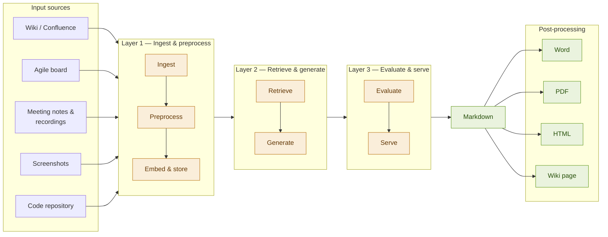

# Functional Guide Generator

**System Design Document** &nbsp;·&nbsp; *Work in progress*

---

## 1. Motivation

### 1.1 Problem statement

Functional documentation is rarely written after a feature ships — knowledge embedded in tickets, code, wikis and demos never makes it into a readable guide.

### 1.2 Solution

The Functional Guide Generator generates structured, readable documentation from existing sources:

- Requirements and specifications (wiki, documents, backlog)
- Application screens
- Notes and recordings of demos
- Developer tickets (user stories, scrum board)
- Source code (GitHub)

### 1.3 Restrictions

- No new information is created — the system assembles and rephrases what is already known
- English only (at start)
- Not for technical documentation

### 1.4 Prerequisite

> At least one input stream must contain quality information — garbage in, garbage out.

---

## 2. System Components

### 2.1 Layers

| Layer | Label               |
| ----- | ------------------- |
| 🔵    | Ingest & preprocess |
| 🟢    | Retrieve & generate |
| ⚪    | Evaluate & serve    |

### 2.2 Component details

| Component                       | Role                                               | Technology                         | Layer     |
| ------------------------------- | -------------------------------------------------- | ---------------------------------- | --------- |
| **Input Ingestion**       | Fetch raw artifacts from source systems            | REST / GitHub / Confluence APIs    | Input     |
| **Preprocessing**         | Clean, chunk, normalise text and images            | LangChain splitters, Tesseract OCR | Input     |
| **Embedding Model**       | Convert chunks to vectors or relational DB entries | text-embedding-3-small (OpenAI)    | Input     |
| **Data Store**            | Vector + relational storage                        | Qdrant · PostgreSQL               | Retrieval |
| **LLM**                   | Synthesise retrieved context into docs             | TBD — open source preferred       | Retrieval |
| **Prompt Engine**         | Manage templates, section targeting                | LangChain LCEL                     | Retrieval |
| **Evaluation Module**     | Score grounding, coverage, readability             | LLM-as-judge + ROUGE-L             | Quality   |
| **API Layer** *(Later)* | Expose generate / status / feedback endpoints      | FastAPI + uvicorn                  | Serving   |
| **UI** *(Later)*        | Source selection, generation, review, export       | React SPA (MVP: CLI / Jupyter)     | Serving   |

> Not all components are required in the first iteration, nor mandatory for each pipeline.

---

## 3. Data Flow

### 3.1 Diagram

**Input sources**

1. Requirements (wiki, Word)
2. Application screenshots
3. Meeting notes / recordings
4. Developer tickets (scrum board)
5. Source code (GitHub)

**Operations**

- Ingest & preprocess
- Retrieve & generate
- Evaluate & serve

**Output sections**

Overview · Step-by-step guide · Business rules · FAQ · Glossary

**Output formats**

- Markdown *(primary)*
- Word · PDF · HTML · Wiki page *(post-processing)*

> *TODO: Review sections 3.2 and 3.3 based on course content*

### 3.2 Ingestion (offline / on-demand)

- User connects one or more input source systems (Confluence wiki, Jira board, GitHub repo, screenshot folder).
- The Input Ingestion connectors fetch raw artefacts via their APIs or file system paths.
- The Preprocessing pipeline:
  - cleans text
  - extracts text from images (OCR)
  - chunks documents into 400–600 token segments
  - attaches metadata (source type, URL, date, ticket ID)
- Each chunk is encoded by the Embedding Model into a vector and stored in the Vector Store alongside its metadata.

### 3.3 Generation & Evaluation (online / per request)

- User selects the target feature or the sections to generate *(v2 only)*:
  1. Overview
  2. Step-by-step guide
  3. Business rules
  4. FAQ
  5. Glossary
- The API Layer receives the request and passes it to the Prompt Engine.
- The Prompt Engine formulates a retrieval query per section and fetches:
  - top-k relevant chunks from the vector store (semantic search), or
  - results via SQL query from the relational database
- Retrieved chunks + a structured prompt template are forwarded to the LLM, which writes the output in plain language.
- Each generated section is passed to the Evaluation Module, which scores grounding and coverage. Sections below threshold are flagged for review.
- The assembled document is returned in markdown format; post-processing yields Word, PDF, HTML, or wiki page.

---

## 4. Model & Tool Choices

| Concern                   | Choice                              | Alternative       |
| ------------------------- | ----------------------------------- | ----------------- |
| **Text generation** | TBD via LLM gateway (e.g. Tiny LLM) | GPT-4o            |
| **Embeddings**      | text-embedding-3-small              | Cohere Embed v3   |
| **Vector store**    | Qdrant                              | PGVector · FAISS |
| **Relational DB**   | PostgreSQL                          | —                |
| **OCR** *(Later)* | Claude Vision + Tesseract fallback  | AWS Textract      |
| **Orchestration**   | LangChain LCEL                      | LlamaIndex        |

---

## 5. Evaluation Strategy

Five dimensions at generation time, plus post-publish user feedback. Human review critical in early iterations.

| Dimension                   | Method                                             | When   | Target                        | Tooling         |
| --------------------------- | -------------------------------------------------- | ------ | ----------------------------- | --------------- |
| **Factual grounding** | LLM-as-judge: every claim traceable to a chunk?    | Sync   | ≥ 90% sentences grounded     | LLM rubric      |
| **Coverage**          | % functional areas from source mentioned in output | Sync   | ≥ 80% coverage               | Keyword overlap |
| **Lexical overlap**   | ROUGE-L vs reference doc                           | Async  | ≥ 0.35 ROUGE-L               | rouge-score     |
| **Readability**       | Flesch-Kincaid + LLM clarity score                 | Async  | Grade 10–14; clarity ≥ 4/5  | textstat        |
| **User acceptance**   | Thumbs-up/down + edit distance after export        | Manual | ≥ 70% 👍 without major edits | UI widget       |

### Some quality questions

1. Do we consistently use the same terms for an item?
2. How to assess 'quality' of documentation?
   - It should give a high-level overview of how the application works
   - *If available*: compare with an existing reference functional guide of high quality
   - Document is really used/ready? *(can only be validated afterwards)*
3. Is our Glossary of terms complete? When should a term be added?

> *TODO: Review evaluation table — still in progress*

### 5.1 Evaluation Pipeline

- **Grounding** and **coverage** checks run synchronously; results returned in the API response as a `quality_score` object.
- **ROUGE-L** and **readability** run asynchronously when a reference document is available.
- **User acceptance** is manual; feedback is stored for periodic fine-tuning of the LLM-as-judge rubric.

---

## 6. Trade-offs & Limitations

| Area                          | Limitation                               | Mitigation                      |
| ----------------------------- | ---------------------------------------- | ------------------------------- |
| **Source quality**      | Garbage-in, garbage-out                  | Warn on low similarity scores   |
| **Real-time sync**      | No auto re-ingestion on change           | Manual re-index via API (v2)    |
| **Code understanding**  | Indexed as text; no AST analysis         | Acceptable for v1; deeper in v2 |
| **Multilingual output** | Follows dominant source language         | Language override param in v2   |
| **Hallucination**       | LLM may infer absent behaviour           | Grounding check + human review  |
| **Access control**      | No per-user permission model             | OAuth connectors in v2          |
| **Output format**       | Markdown only; export is post-processing | Converters for all targets      |

---

## 7. Next Steps / Iterations

### 7.1 First implementation

1. Start with a high-quality input source
2. Build one end-to-end pipeline

### 7.2 Possible iterations

**v2**

- Automatic incremental re-indexing triggered by webhook (Jira, GitHub events)
- AST-level code understanding to improve step-by-step guides for complex workflows
- Per-user ACL on source connectors using OAuth 2.0 token delegation
- Explicit output language selection (e.g. always generate in English)

**v3**

- Confluence / Word export via dedicated post-processing converters
- More dynamic UI and output API

**v4**

- Extend audience to external stakeholders
- Support pages for end-users; additional document types

---

### Open to-dos

- [ ] Add HL diagram (Mermaid diagram included in section 3.1)
- [ ] Include sprint findings in document
- [ ] Select a subset for the demo
