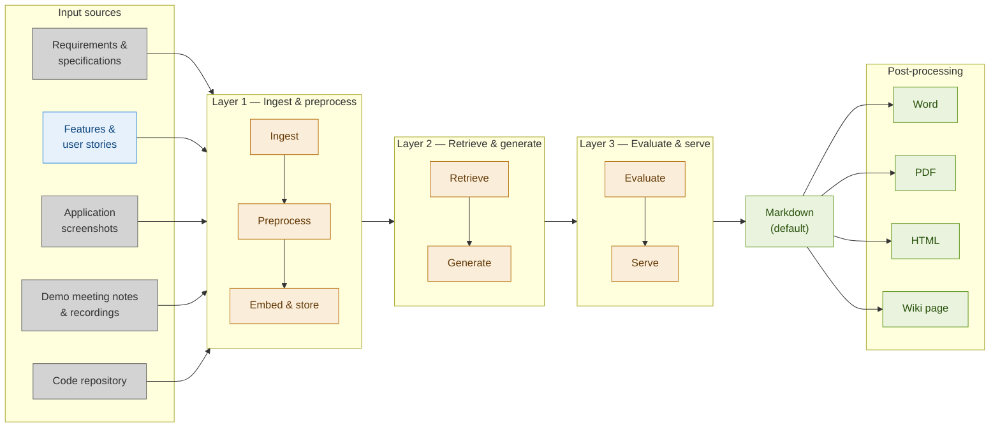

# Functional Guide Generator

**System Design Document**    *v8*

---

## 1. Motivation

### 1.1 Problem statement

Writing functional documentation after the implementation of a software feature is rarely done in practice. Developers start working on next tickets, product owners focus on acceptance or the next backlog item — the acquired knowledge embedded in tickets, code, wikis, and demos never makes it into a more functional-oriented manual.

### 1.2 Solution

The Functional Guide Generator aims to generate structured, meaningful and readable functional documentation based on available information sources, written for persons (not for documentation agents).

### 1.3 Restrictions

- No new information is created. The system assembles and rephrases what is already implicitly known.
- Information will not be updated in real time, nor will we have automated interfaces for input of information.
- Documentation is only in English
- We exclude creation of technical documentation

> These restrictions may be lifted in future iterations.

### 1.4 Prerequisite for implementation

> Minimal one of the input data streams should contain quality information to avoid creating a 'garbage in, garbage out' solution.

---

## 2. System Components

### 2.1 Layers

The system is composed of the following possible logical components, grouped into three layers:

- **Ingest & preprocess**: input ingestion, preprocess, embed
- **Retrieve & generate**: data store, LLM
- **Evaluate & serve**: prompt engine, evaluation model, API layer, UI

### 2.2 Component details

| Component | Role | Technology / Service |
| - | - | - |
| **Input Ingestion** | Fetches raw artifacts from source systems (wiki, screenshots, Jira, GitHub) | Import of CSV data file; REST / GitHub / Confluence API, screen capture lib |
| **Preprocessing** | Cleans, chunks, and normalises text and images before indexing | LangChain text splitters; SQL queries |
| **Embedding Model** | Converts chunks into dense vectors for semantic search or into relational DB entries | text-embedding-3-small (OpenAI) — low cost |
| **Data store** | Vector Store: stores and retrieves most relevant chunks for semantic search, supports metadata filtering | Qdrant |
| **LLM** | Synthesis of retrieved context into structured functional documentation | Aim for: open source, strong summarization, long context window — compare and select model at last moment |
| **Prompt Engine** | Manages prompt templates, document template with sections | LangChain LCEL chains with custom prompt templates |
| **Evaluation Module** | Scores generated doc, if possible using a reference document; ends with manual verification | LLM-as-judge for different criteria; manual user feedback |

---

## 3. Data Flow

The diagram contains the following information:

**Input sources — general**

1. Requirements and specifications (e.g. company wiki, documents, features on product backlog)
2. Features & user stories (on agile board — for developers)
3. Application screenshots
4. Demo meeting notes & recordings
5. Code repository (e.g. GitHub)

In practise this can be:

- Requirements and specifications from wiki — Confluence, Notion, documents
- Agile board with features and user stories (Jira, Azure DevOps)
- Application screenshot folder
- AI-generated meeting notes, recording
- Code repository (GitHub repo)

**Note on input sources**: Only the "Features & user stories" (Agile board) is currently used as an input source. The other four input sources (Requirements & specifications, Application screenshots, Demo meeting notes & recordings, Code repository) have a darker grey background to indicate they are not yet integrated.

**Operations**

- Ingest & preprocess
- Retrieve & generate
- Evaluate & serve

**Output sections**

- Overview
- Step-by-step guide
- Business rules
- FAQ
- Glossary

We create a high-level overview of the software in max. 2–7 pages, covering how the application works and what its functionality is.

**Output formats**

- Markdown *(default)*
- Word, PDF, HTML, wiki page *(post-processing)*

> *From here onwards we only describe further actions for one input source: "Agile board with features and user stories".*
>
> *Motivation: we expect this to be the most high-value information. Every implementation works with an agile board, even when the level of detail of information can strongly vary.*

### 3.1 Ingestion & Preprocessing (offline / on-demand)

- Read the input from a CSV file from the agile board for the application (Jira, Azure DevOps)
- Preprocessing pipeline:
  - cleans text, validates the input data (e.g. checks if all data is filled in)
  - *optional*: validates if a template is used in the description (of user story, etc.)
  - chunks documents into 400–600 token segments
  - a document contains only stories belonging to one feature
  - a user story is not split over multiple chunks
  - every chunk contains only items of one agile type (e.g. story, feature)
  - vector store holds only title and free-text fields (description, acceptance criteria)
  - metadata holds only the additional relevant agile data (source type, date created, agile board ID, parent feature/epic ID of story, related stories with type relation)
- Each chunk is encoded by the Embedding Model into a vector and stored in the Vector Store alongside its metadata.

### 3.2 Retrieval, Generation & Evaluation (online / per request)

- Configuration is done manually for the target feature and the output sections to generate.
- The input request is passed to the Prompt Engine.
- The Prompt Engine formulates a retrieval query for each target output section:
  - assesses query improvements (e.g. query decomposition, context scoring by feature/functionality, category — front end / back end / other)
  - fetches the top-k relevant chunks from the vector store via semantic or similarity search
- Retrieved chunks plus a structured prompt template are forwarded to the LLM, which writes the output in plain language.
- Each generated section is passed to the Evaluation Module, which scores the defined criteria. Sections below a threshold are flagged for review.
- A human evaluation is done at the end.
- The assembled document is returned in markdown file format; through post-processing, other output types can be created: Word, PDF, HTML, wiki page.

---

## 4. Model and Tool choices

| Concern | Choice | Rationale | Alternative considered |
| - | - | - | - |
| **Text generation** | 'LLM to be chosen' | Decide model choice at last moment, comparing cost/result; access through LLM gateway (e.g. LiteLLM) | Claude Sonnet 4.6 — too costly · GPT-4o — comparable but higher latency on long contexts |
| **Embeddings** | text-embedding-3-small | Good semantic quality at low cost; 1536-dim vectors | Cohere Embed v3 — better multilingual but higher cost |
| **Vector store** | Qdrant | Similarity search; easy Docker deployment | PGVector — integration with Postgres |
| **Orchestration** | LangChain LCEL | Composable chains; native Qdrant and OpenAI integrations | LlamaIndex — strong document handling but heavier abstraction |
| **Evaluation & Monitoring** | Langfuse | Easy to use; standard evaluation & logging | — |

**Alternatives for data store**

We will use as input source a CSV file with agile board items (Jira CSV, Azure DevOps CSV with user stories, features, etc.) for a specific epic or 'application' functionality.

- These CSV files contain individual fields, most with a specific restrictive data type. Some fields will have a free-format text field, e.g. 'description' and 'acceptance criteria'. 'description' will contain clarifying information about the backlog item.

- For data storage we can decide between two options, based on initial status:
  - Vector store with other required agile fields as metadata — probably better to be able to relate similarities
  - If it's not many GBs of data, Postgres + PGVector combo can be used for more traditional relational querying and the ability to do vector search. If the original data is already in Postgres, this is even more an option.

---

## 5. Evaluation Strategy

Quality is assessed:

- automatically through LLM-as-a-judge, using standard evaluation metrics
- manually through human review and via post-publish user feedback

> No single evaluation metric is sufficient. In first iterations, human review will probably be more important.

| Parameter | Metric / Method | Target | Tooling |
| - | - | - | - |
| **Completeness** *(automated)* | Presence of all required document sections; per section template structure & content used | 100% requested sections; 80% requested templates | Langfuse; Similarity search |
| **Precision** *(automated)* | Precision = Claims in response that ARE supported by context / Total claims in response. Is every claim traceable to a retrieved chunk? | ≥ 90% precision (Accuracy of the retrieved context) | Langfuse with Ragas |
| **Context recall** *(automated)* | Context recall = Relevant facts in context that appear in response / Total relevant facts in context | ≥ 85% context recall (Ability to retrieve all relevant information) | Langfuse with Ragas |
| **Coverage** *(automated)* | % of functional areas in agile tickets mentioned in output | ≥ 80% coverage | Keyword extraction + overlap check |
| **Lexical overlap** *(if reference doc)* | Similarity search vector DB vs. human-written reference (where available) | ≥ 90% similarity search *Concern*: pure semantic similarity here is not informative | vector DB |
| **Readability** *(if reference doc)* | LLM clarity score | Clarity ≥ 4/5 | textstat + LLM rubric |
| **User acceptance** *(manual)* | Manual reviewer classifies output | ≥ 60% OK | Manual annotation |
| **Post-publishing user feedback** *(UI)* | Reviewer thumbs-up/down on final doc | ≥ 70% thumbs-up without major edits | UI feedback widget |

### 5.1 Evaluation Pipeline

- Automated checks using LLM-as-a-judge run synchronously for **completeness**, **precision**, **context recall**, and **coverage**.
- A reference document is required for **lexical overlap** and **readability scores**. These run asynchronously when a reference is available.
- **User acceptance** is manual.

Post-processing **user feedback** is collected from the UI and stored for periodic fine-tuning.

#### We try also to answer these questions

- Do we have consistent terminology? Do we consistently use the same term for every concept?
  - This could be a kind of 'automatic term extraction'
  - Create embeddings (per 'term' or 'concept')
  - Cluster the embeddings to understand whether they refer to the same concept
- Is our glossary of terms complete? Criterium to add a 'concept' to the glossary: A concept is used for the first time and we have a definition for it.
- We define the quality of functional documentation as documentation which is actually used or read. Unfortunately this is difficult to measure 'before' availability of the documentation — we will use quality metrics as above.
- What to do with other agile item types (bug, task, etc.)?

---

## 6. Trade-offs and Limitations

| Area | Limitation / Decision | Reason / Mitigation |
| - | - | - |
| **Source quality** | Garbage-in, garbage-out; poor tickets or vague specs yield shallow docs | Warn user when clean-up detects a lot of low-quality data, or retrieved chunks have low similarity scores; prompt for better sources |
| **Hallucination** | LLM may infer behaviour not present in sources | Grounding check flags low-confidence sentences; human review step required before publish |
| **Output format** | Generates Markdown; post-processing is export to Word, Confluence, etc. | Markdown is the most portable intermediate format; converters exist for target formats |
| **Cost** | Multiple LLM calls can become costly; balance cost with quality e.g. for evaluation | Use small LLMs for specific tasks; assess cost of different automatic evaluations |
| **Context window size** | 1. Keep it small. 2. Do section-by-section generation | Context window size should not be bigger than needed to generate a document of 2–6 pages; hallucinations tend to increase with document length; section-by-section generation works better with explicit outline pass before generation actually takes place |
| **Real-time sync** | No automatic re-ingestion when a ticket or code file changes | *Later*: manual re-index |
| **Multilingual output** | Generation language follows the dominant language of sources | *Later*: explicit language override parameter planned |
| **Access control** | No per-user permission model on source artifacts | *Later*: assumes operator controls which sources are connected |

---

## 7. Ideas to improve the overall quality

The solution can only work if you have at least one input source with quality information. When using agile board items as the input data source:

- **Data quality and structure**: On an agile board, the level of detail of information can strongly vary — from a one-liner backlog item up to a lot of detail almost at pseudo-code level. Therefore:
  - use a template for user story, feature, etc. to make data extraction easier
  - ensure the description is always detailed enough to use it in the documentation

- **Feature identification**: How to identify all backlog items which are relevant for the functionality to document?
  - Ensure all items are grouped together

- **Documentation quality definition**: Further specify what is 'good' documentation, i.e. documentation which is really used/read.
  - Get additional input through human review/acceptance

---

## 8. Next steps / Iterations

### 8.1 First implementation steps

**v0**

- Implement a few steps first and use them to check for quality
- Embed & store (chunking of information, embedding)
- Evaluate

**v1**

- Start with one input source for which we expect to have rather high-quality input, i.e. agile backlog items (user stories, features)
- For this input, create the data pipeline
- Start with 1 or 2 automated evaluations

### 8.2 Incremental improvements — possible next iterations

**v2**

- Increase quality by adding more automated evaluations
- Automatic incremental re-indexing triggered by webhook (Jira, GitHub events)

**v3**

- Access control: per-user authentication and authorization
- More dynamic (UI, output API)

**v4**

- Explicit output language selection (e.g. always generate in English regardless of source language)

**v5**

- At start it will be primarily a functional description for internal company usage
- Extend audience (e.g. to external stakeholders, to documentation agents)
- Use other document types, e.g. to make 'support' pages for end-users

---

## Annex — Questions

- Context window size — Section-by-section generation tends to work better with an explicit outline pass before generation actually takes place: What does this 'explicit outline pass' mean?

---

## Annex — To Do

- Include in doc findings of sprint
- Use a subset of the above for demo
